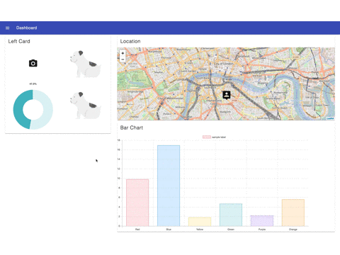

# hifive DashBoard Template

[](https://circleci.com/gh/mpppk/ts-hifive-boilerplate/tree/master)
[](https://www.codacy.com/app/niboshiporipori/hifive-dashboard-template?utm_source=github.com&amp;utm_medium=referral&amp;utm_content=mpppk/hifive-dashboard-template&amp;utm_campaign=Badge_Grade)
[](https://gitlab.com/mpppk/hifive-dashboard-template/commits/master)
[](https://gitlab.com/mpppk/hifive-dashboard-template/commits/master)



## Getting Started

```
$ git clone https://github.com/mpppk/hifive-dashboard-template.git
$ cd hifive-dashboard-template
$ npm install
$ npm start
# Your application is served on http://localhost:8080
```

Refer [mpppk/ts-hifive-boilerplate](https://github.com/mpppk/ts-hifive-boilerplate) for usage of other npm scripts.
